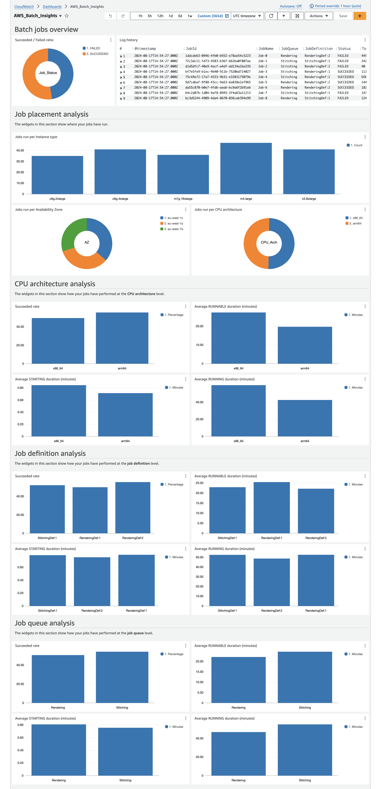
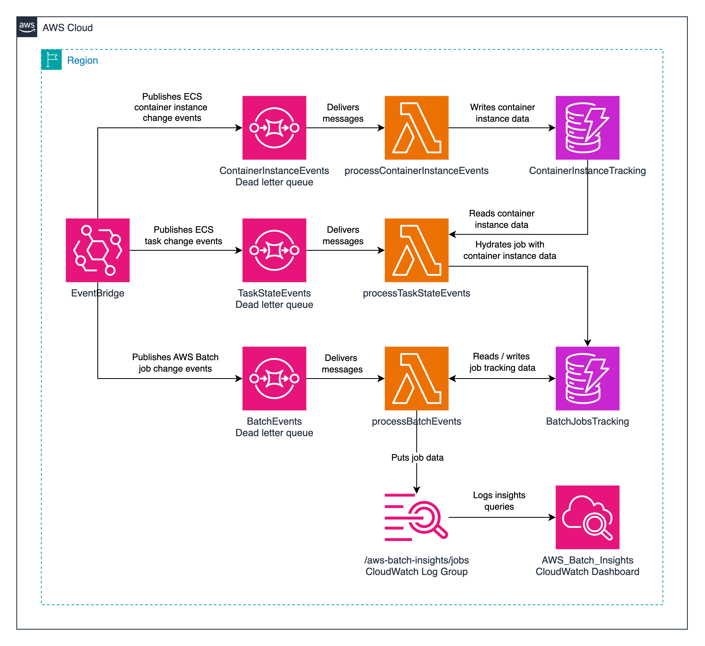

# Batch Insights Dashboard

Author: Borja Pérez Guasch <bpguasch@amazon.es>

## In this page

- [Introduction](#Introduction)
- [Dashboard sections](#dashboard-sections)
- [Project architecture](#project-architecture)
- [Logs generated](#logs-generated)
- [Deploying the project](#deploying-the-project)
- [Updating the project](#updating-the-project)
- [Cleaning up](#cleaning-up)

## Introduction

Batch Insights Dashboard provides full traceability of your job execution lifecycle by aggregating data from different AWS Event Bridge events associated to each job submission.

Thanks to this solution, you can know in which particular EC2 Instance each job run, allowing you to analyse runtime insights from different dimensions (job queue, job definition, instance type, AZ, CPU architecture...).

## Dashboard sections

The dashboard groups the information in the sections described below for easier analysis:

### Batch jobs overview

The widgets in this section display the following information:

- Overall succeeded / failed ratio
- All job aggregated data in a logs table. See [logs generated](#logs-generated) for more details.

### Job placement analysis

The widgets in this section display the following information:

- Jobs run per instance type
- Jobs run per Availability Zone
- Jobs run per CPU architecture

### CPU architecture analysis

The widgets in this section display the following information, aggregated per CPU architecture:

- Succeeded rate
- Average `RUNNABLE` duration
- Average `STARTING` duration
- Average `RUNNING` duration

### Job definition analysis

The widgets in this section display the following information, aggregated per job definition:

- Succeeded rate
- Average `RUNNABLE` duration
- Average `STARTING` duration
- Average `RUNNING` duration

### Job queue analysis

The widgets in this section display the following information, aggregated per job queue:

- Succeeded rate
- Average `RUNNABLE` duration
- Average `STARTING` duration
- Average `RUNNING` duration

The following illustration shows the AWS Batch Insights Dashboard:



## Project architecture

The diagram below ilustrates the infrastructure deployed using CloudFormation:



When submitting a batch job, there are three EventBridge events that we must track to aggregate all the information associated to the job:
- `ECS Container Instance State Change`: generated when an EC2 instance is registered to / deregistered from an ECS cluster.
- `ECS Task State Change`: generated when there is a state change in an existing task. This event's information contains the container instance where the task is placed, and the associated batch job ID.
- `Batch Job State Change`: generated when a batch job transitions from one state to another.

The DynamoDB tables are used to temporarily store and aggregate all the information described above, until it is logged to CloudWatch when a job completes its execution. Then, all the tracking data is removed from DynamoDB.

There is one Lambda function per each EventBridge event that is captured. Each of them is in charge of processing the event and storing the data in the respective DynamoDB table.

## Logs generated

The application writes job data to a log group named `/aws-batch-insights/jobs`. Messages are retained for **1 year**. The `message` property of each log event is a JSON-formatted text with the payload below:

```
{
    "JobName": "Job-75",
    "JobId": "4fa1c1bc-2859-4552-bc28-94c23e4051c5",
    "InstanceId": "365d9279-ae5a-4bce-b745-551b51ab885e",
    "JobQueue": "Rendering",
    "Status": "SUCCEEDED",
    "JobDefinition": "StitchingDef:1",
    "AvailabilityZone": "eu-west-1c",
    "Architecture": "arm64",
    "InstanceType": "c6g.4xlarge",
    "TotalRunnableSeconds": 2550,
    "TotalStartingSeconds": 76,
    "TotalRunningSeconds": 3693
}
```

## Deploying the project

### 1. Cloning the repository

After navigating to your path of choice, execute the command below to clone this repository:

```bash
git clone git@github.com:aws-samples/batch-insights-dashboard.git
```

### 2. Creating a virtual environment and installing project dependencies

To create a virtual environment, execute the commands below:

```python
cd batch-insights-dashboard/cdk-project
python3 -m venv .venv
```

To install project dependencies, execute the commands below:

```python
source .venv/bin/activate
python -m pip install -r requirements.txt
```

### 3. Bootstrapping your AWS account

Deploying AWS CDK apps into an AWS environment may require that you provision resources the AWS CDK needs to perform the deployment.
These resources include an Amazon S3 bucket for storing files and **IAM roles that grant permissions needed to perform deployments**.
Execute the following command to bootstrap your environment:

```bash
cdk bootstrap
```

You can read more about this process [here](https://docs.aws.amazon.com/cdk/v2/guide/bootstrapping.html).

### 4. Deploying using CDK

To deploy the project, execute the following command:

```bash
cdk deploy
```

The deployment process will take roughly **3 minutes** to complete.

## Updating the project

To update the project, navigate to the directory where you initially cloned the repository and execute the command below:

```bash
git pull
cd cdk-project
cdk deploy
```

## Cleaning up

Option 1) deleting all the resources using the AWS Console:

1. Navigate to the **CloudFormation** section in the AWS console.
2. Select the stack named **AWSBatchInsightsDashboard** and click on **Delete**.

Option 2) deleting all the resources using the CLI:

Navigate to the directory where you initially cloned the project and execute the following command:

```bash
cd cdk-project
cdk destroy
```
